# EasySudoku

EasySudoku is a solver-verified, step-by-step Sudoku tutor for learners who want to understand the next move instead of receiving a finished grid. A user can upload a puzzle photo or enter givens manually; local OCR extracts the board, human-readable rules explain approachable deductions, and Z3 verifies harder eliminations. Runtime answers are produced by deterministic Sudoku rules and an SMT solver—not by an LLM guessing a move.

中文简介：EasySudoku 是一个支持拍照识别、中英文讲解与历史回放的可解释数独导师。它优先展示符合人类思路的规则，并以 Z3 作为复杂局面的验证后盾。

## Why it exists

Most Sudoku apps optimize for completing a puzzle. EasySudoku is designed for people learning how to solve one: it exposes candidates, identifies the target cell, explains why a value is forced, records each step, and lets the learner replay the reasoning. It deliberately separates OCR confidence from solver correctness—the recognized givens remain editable before confirmation.

## Features

- Local image recognition with OpenCV perspective correction and an ONNX digit model; no external OCR API.
- Human rules first: Hidden Single and Naked Pair, with Z3 UNSAT Core verification as the general fallback.
- Brief, Teaching, and Technical explanation modes in Simplified Chinese and English.
- Candidate display, cell hints, step history, back/forward replay, and refresh restoration.
- Responsive Vue 3 interface for desktop and mobile.
- Structured API errors, bounded uploads, health/version endpoints, and explicit production frontend checks.
- A reproducible synthetic demo fixture and automated Python, API, Playwright, and Docker verification.

## Quick start

Requirements: Python 3.10+ and Node.js 22+ with npm.

```bash
python -m venv venv

# Linux / macOS
source venv/bin/activate
# Windows PowerShell
# .\venv\Scripts\Activate.ps1

python -m pip install -r requirements.txt
cd frontend
npm ci
npm run build
cd ..
python -m uvicorn main:app --host 127.0.0.1 --port 8000
```

Open <http://127.0.0.1:8000>. The repository also provides `run.sh` and `run.bat` for local setup.

### Fixed demonstration puzzle

Click **Load demo puzzle / 加载演示题目** in the app, or upload `examples/demo_sudoku.png`. The PNG is deterministically generated from `examples/demo_grid.json`; it validates the clean integration path but is not evidence of real-photo OCR accuracy.

### Docker

```bash
docker build -t easysudoku .
docker run --rm -p 8000:8000 easysudoku
```

The production image builds the Vue app with `npm ci`, runs FastAPI as a non-root user, and exposes a `/health` Docker health check. A missing Vue build is a startup-facing `503` response unless legacy mode is explicitly enabled with `ALLOW_LEGACY_FRONTEND=1`.

## How the product works

1. Choose Chinese or English.
2. Upload a puzzle image, load the fixed demo, or type givens manually.
3. Review and correct OCR output, then confirm the givens.
4. Select a cell for candidates or request the next deduction.
5. Change explanation depth and replay the history.
6. Refresh to restore the board, history, language, mode, and uploaded preview.

## Architecture

```mermaid
flowchart LR
    A["Image upload or manual givens"] --> B["Local OpenCV + ONNX OCR"]
    B --> C["Editable 9×9 board"]
    C --> D["Candidate analysis"]
    D --> E["Human rules: Hidden Single / Naked Pair"]
    E --> F["Z3 SMT + UNSAT Core fallback"]
    F --> G["Structured deduction step"]
    G --> H["Vue i18n explanations"]
    H --> I["History + browser persistence"]
```



The solver pipeline is layered: Python bitmask prechecks remove direct row/column/box conflicts; human rules find teachable moves; Z3 verifies the remaining forced values. The frontend renders structured fields such as `rule_type`, `target_cell`, `candidate_changes`, and `verification_type`, instead of relying on an LLM-generated explanation.

See [architecture details](docs/architecture.md) for trust boundaries and deployment behavior.

## API

| Method | Path | Purpose |
|---|---|---|
| `GET` | `/health` | Frontend and OCR resource readiness |
| `GET` | `/version` | Sanitized application version and optional commit |
| `POST` | `/upload` | Bounded image upload to a 9×9 recognized grid |
| `POST` | `/next-step` | Next deduction plus structured step and compatibility fields |
| `POST` | `/hint-cell` | Candidates and eliminations for one cell |
| `POST` | `/solve` | Deterministic complete solution, if one exists |

## Verification

```bash
source venv312/bin/activate
python test_phase1.py
python test_phase2.py
python test_phase3.py
python test_demo.py
python test_api.py

./scripts/npm-safe.sh --prefix frontend run type-check
./scripts/npm-safe.sh --prefix frontend run build

# Start FastAPI first, then:
cd frontend
EASYSUDOKU_BASE_URL=http://127.0.0.1:8000 npm run test:smoke
```

The current checked-in evaluation records only commands actually run. Real-photo OCR accuracy, latency percentiles, and a real-world sample count remain unmeasured for this submission; see [evaluation](docs/evaluation.md).

## Build Week

Git history establishes the boundary used for this submission:

- Before Build Week (commits `8e8e856` through `639f9da`, 2026-05-26 to 2026-05-27): FastAPI/HTML prototype, Z3 and UNSAT Core solver, basic human rules, OpenCV/ONNX OCR, launch scripts, and an initial Docker setup.
- Build Week (starting with `171a34c`, 2026-07-17): Vue 3/TypeScript responsive UI, bilingual structured explanations, explanation modes, candidate/history/persistence flows, expanded Playwright coverage, production API hardening, reproducible demo assets, CI, and deployment documentation.

The detailed evidence table is in [docs/build_week.md](docs/build_week.md).

## Human decisions and Codex contributions

### Human decisions

- Product direction: teach the next logically justified move rather than reveal only a full answer.
- Trust model: deterministic human rules and Z3 verification own runtime correctness; OCR output is reviewable.
- Architecture and scope: local OCR, structured bilingual explanations, browser-side history/persistence, and preservation of the existing solver core.
- Submission constraints: do not invent metrics, links, contribution records, or external-platform status.

### Codex contributions

Codex 5.6 sol assisted with repository auditing, incremental Vue/FastAPI hardening, test design and execution, fixed demo fixtures, Docker/CI configuration, and documentation. The project author retains responsibility for product choices, reviewing changes, measuring claims, licensing, deployment, and submission.

**GPT-5.6 contribution pending final audit**. No Codex Session ID is published until the project author verifies the correct value.

## Live demo and submission

- Live demo: `LIVE_DEMO_URL_PENDING`
- Three-minute walkthrough: [docs/demo_script.md](docs/demo_script.md)
- Submission checklist: [docs/submission_checklist.md](docs/submission_checklist.md)

External deployment, public repository visibility, video publishing, Devpost fields, licensing, and model/dataset attribution remain manual verification tasks.

## Repository map

```text
EasySudoku/
├── main.py, smt_engine.py, heuristic_engine.py, vision.py
├── frontend/                 # Vue 3 + Vite + TypeScript application and Playwright tests
├── examples/                 # deterministic puzzle, solution, generator, and demo PNG
├── models/                   # local ONNX model
├── docs/                     # architecture, Build Week, evaluation, demo, and checklist
├── test_phase*.py            # solver and vision structure tests
├── test_demo.py, test_api.py # demo contract and FastAPI tests
├── Dockerfile
└── .github/workflows/ci.yml
```

## Roadmap

- Add Pointing Pair, Box-Line Reduction, Naked Triple, Hidden Pair, and later X-Wing.
- Build a labeled, consented real-photo OCR evaluation set and publish the exact methodology.
- Add richer candidate-change narration and complete deduction-chain playback.
- Deploy only after validating privacy, model/dataset attribution, public links, and clean-browser behavior.
