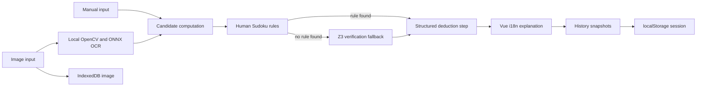

# EasySudoku Architecture

## End-to-end flow

## Responsibility boundaries

| Layer | Responsibility | Does not do |
|---|---|---|
| Vue frontend | input, correction, confirmation, localized explanation, history, recovery | invent a solution |
| OpenCV/ONNX | detect the puzzle and transcribe visible digits locally | decide which missing digit is logically valid |
| Candidate computation | remove values already used in the row, column, or box | replace the SMT model |
| Human-rule engine | prefer explainable Hidden Single and Naked Pair deductions | guess when a rule is unavailable |
| Z3 engine | enforce domains and row/column/box uniqueness; verify alternatives through UNSAT | generate prose with an LLM |
| Structured step adapter | preserve machine-readable rule, target, candidate changes, and verification type | change the solved value |
| Browser persistence | restore the current session and uploaded image locally | upload state to a remote account |

## Trust model

OCR results are always editable before the user confirms the givens. After confirmation, the initial cells are locked. A human rule is used when implemented and applicable; otherwise Z3 is the deterministic fallback. The LLM-assisted development process can help write or test code, but it is not in the runtime answer path.

## API compatibility

The Vue client uses `/upload`, `/next-step`, `/hint-cell`, and `/solve`. `/next-step` includes structured fields while retaining legacy fields for the existing HTML client. Operational endpoints `/health` and `/version` expose only readiness and version metadata—never filesystem paths or arbitrary environment values.

## Production frontend policy

Production serves `frontend/dist/index.html`. A missing build is a deployment error with an explicit instruction to run the frontend build. The legacy `templates/index.html` remains available only when `ALLOW_LEGACY_FRONTEND=1` is deliberately configured. Unknown API-like paths must remain JSON 404 responses instead of being swallowed by the SPA fallback.
